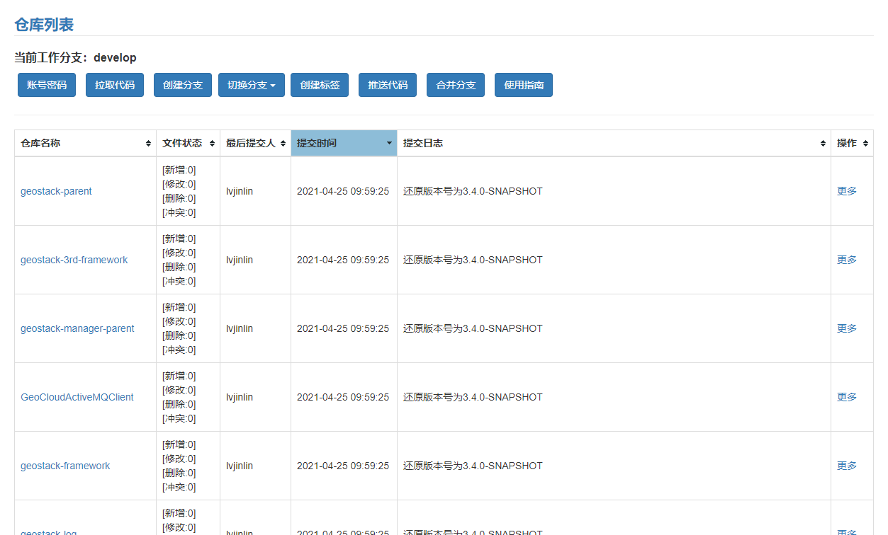

# Git仓库代码批量管理程序

## 概述

程序实现批量管理Git仓库的能力，配置一组Git仓库代码地址（http或https）的列表后能够实现同时操作一组Git仓库。目前已实现账号密码配置、代码拉取、分支创建、分支切换、分支删除、代码推送、标签创建、标签删除等一系列操作，对于模块比较多（我负责的一个项目超过50个模块）的工程项目能够快速操作分支及标签，有效减少重复操作，提高生产效率。

## 程序界面

## 程序功能

### 概述

在程序启动之后第一件事应当是填写账号密码，供管理的一组Git仓库项目使用。**切换分支**时显示分支列表，仅显示这一组Git仓库项目同时存在的分支，**创建分支**时显示标签列表，仅显示这一组Git仓库项目同时存在的标签，所以一般本程序都是用来管理一组开发进度、版本号、分支一致的仓库代码。

### 按钮说明

1. 【帐号密码】：在程序启动之后第一件事应当是填写账号密码，用于和Git服务器交互，重启之后需再次填写，或在 **application.yml** 中写死
2. 【拉取代码】：拉取当前分支最新代码，第一次直接克隆 **master** 分支
3. 【创建分支】：以当前版本库创建新的分支或以某一标签为基础创建新的分支
4. 【切换分支】：切换到指定分支并拉取最新代码
5. 【删除分支】：删除指定分支，不允许删除 **master** 分支和 **develop** 分支
6. 【推送代码】：提交并推送当前分支代码到远程仓库
7. 【创建标签】：创建并推送一个标签到远程仓库
8. 【删除标签】：删除本地及远程仓库中的指定标签，不可回滚，谨慎操作

### 操作说明

1. 第一次拉取远程仓库代码时请确保仓库不为空，否者可能造成工具使用异常
2. 不允许直接在 **master** 分支推送代码， **master** 分支仅允许拉取代码、创建分支、切换分支、创建标签和删除标签操作
3. 新建分支后需主动推送代码到远程服务器，每次推送代码仅推送当前分支
4. 删除分支后程序自动删除远程服务器上对应的分支，同时拉取 **master** 的最新代码
5. 第一次切换到某分支时，程序主动从服务器拉取代码，后面再次切换到该分支不在主动拉取代码，如需更新代码，请点击【拉取代码】按钮手动拉取
6. **master** 分支和 **develop** 分支不允许删除
7. 页面仅展示所有仓库共有的分支和标签，所有的分支创建合并、标签创建推送、代码拉取推送都为所有仓库同时进行

### 配置说明

1. 主配置文件路径，**${project}/src/main/resources/application.yml** ，YAML标记语言编写，请不要出现制表符，注意空格缩进
2. 程序默认端口号，**server.port = 8090**
3. 默认仓库存放目录，**work-home = D:\Git-repository**
4. 默认日志目录，**logging.file.path = ${work-home}\logs**
5. 仓库配置，修改 **projects** 配置项，多个仓库之间换行并加上"- "前缀

## 使用方法

下载发行版jar包 `java -jar git-branch-manager-xxx.jar` 运行，建议直接打开jar包修改 **application.yml** 中的配置项保存后使用